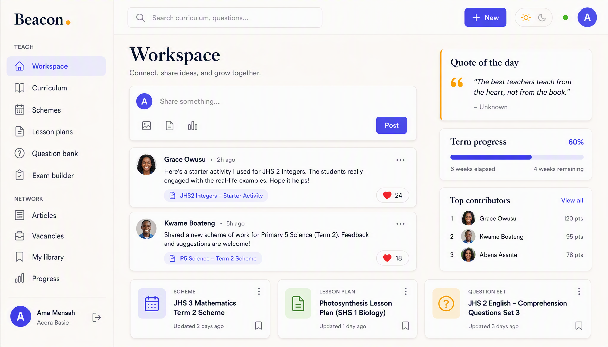
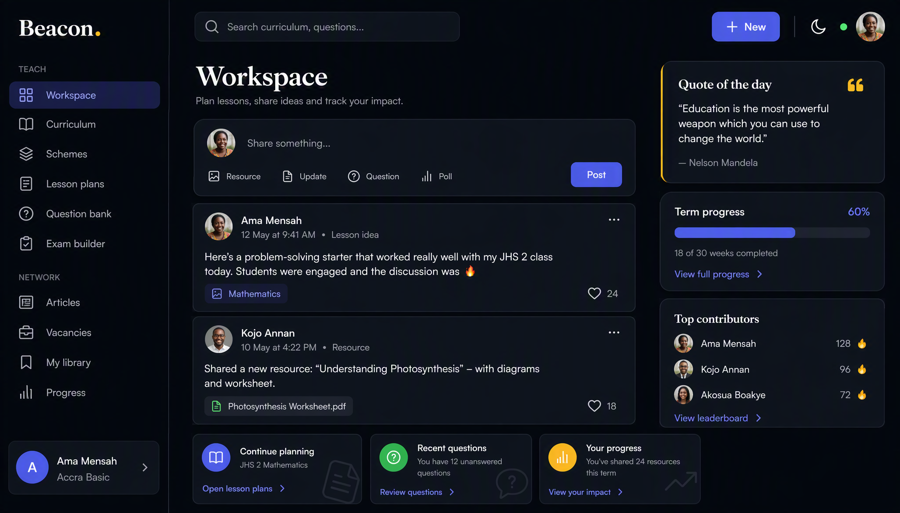

# Beacon Consult — UI/UX Redesign Specification

**Status:** Approved direction · **Scope:** UI/UX only · **Target:** Tailwind CSS v4.3+

> **Hard scope rule.** This redesign changes **presentation and interaction only**. No routes, no
> Firestore queries, no `firestore.rules`, no data shapes, no business logic in `src/lib/` change.
> Every phase must keep `yarn lint` clean and `yarn test` green (including
> `sidebarRoutes.test.js`, which pins nav links to routes). If a proposed change would alter data or
> behaviour, it is out of scope and belongs in a separate change.

---

## Decisions (locked)

| Question | Decision |
|---|---|
| Visual direction | **Refined modern SaaS** — clean, spacious, crisp cards, subtle depth, tight hierarchy |
| Palette | **Refine the existing indigo + amber on cream** (complete the scales, fix contrast, systematize semantics) |
| Dark mode | **Add**, with a **user toggle** (persisted), defaulting to the system preference |
| Navigation | **Left sidebar + persistent top bar** (global search, quick "New", theme toggle, status, account) |

Reference mockups (generated to match these decisions):

| Light | Dark |
|---|---|
|  |  |

---

## 1. Vision & principles

Beacon is a working tool for teachers, often on slow connections and small screens. The redesign
should make it feel **calm, credible and fast** — not decorative.

1. **Consistency over invention.** One way to render a button, a card, a form field, an empty state,
   a loading state, an error. Today these are re-authored per page; the redesign centralises them.
2. **Tokens first.** All colour, type, radius, shadow and spacing come from the `@theme` block and
   semantic CSS variables. Pages never hard-code a hex or an off-scale shade.
3. **Themeable by construction.** Light and dark are the same components with swapped semantic
   variables — no per-page dark overrides.
4. **Accessible by default.** Visible focus, real labels (never placeholder-only), focus traps in
   overlays, WCAG AA contrast in both themes, and reduced-motion support.
5. **Progressive, non-breaking rollout.** Tokens → primitives → shell → pages, each phase shippable
   and green.

---

## 2. Design tokens (Tailwind v4)

Everything lives in `src/index.css`. Rebranding and theming happen **here**, never in component
class strings.

### 2.1 Colour scales (complete, no fallbacks)

The current `@theme` defines only `brand-50/100/500/600/700/900`, yet pages use `brand-200/300/800`,
which silently fall back to stock indigo. Define **full scales** so every shade resolves on-palette.

```css
@theme {
  /* Indigo brand — full scale */
  --color-brand-50:  #eef2ff;
  --color-brand-100: #e0e7ff;
  --color-brand-200: #c7d2fe;
  --color-brand-300: #a5b4fc;
  --color-brand-400: #818cf8;
  --color-brand-500: #6366f1;
  --color-brand-600: #4f46e5;   /* primary (light) */
  --color-brand-700: #4338ca;
  --color-brand-800: #3730a3;
  --color-brand-900: #312e81;
  --color-brand-950: #1e1b4b;

  /* Amber accent — full scale */
  --color-accent-50:  #fffbeb;
  --color-accent-100: #fef3c7;
  --color-accent-200: #fde68a;
  --color-accent-300: #fcd34d;
  --color-accent-400: #fbbf24;
  --color-accent-500: #f59e0b;   /* accent (light) */
  --color-accent-600: #d97706;
  --color-accent-700: #b45309;
  --color-accent-800: #92400e;
  --color-accent-900: #78350f;
}
```

**Semantic status colours** (used via tokens, not raw `red-*`/`emerald-*` in pages):

```css
@theme {
  --color-success-50:#ecfdf5; --color-success-500:#10b981; --color-success-600:#059669; --color-success-700:#047857;
  --color-warning-50:#fffbeb; --color-warning-500:#f59e0b; --color-warning-600:#d97706; --color-warning-700:#b45309;
  --color-danger-50:#fef2f2;  --color-danger-500:#ef4444;  --color-danger-600:#dc2626;  --color-danger-700:#b91c1c;
  --color-info-50:#f0f9ff;    --color-info-500:#0ea5e9;    --color-info-600:#0284c7;    --color-info-700:#0369a1;
}
```

### 2.2 Semantic surface/text tokens + dark mode

Light and dark differ only in these variables. Components reference **semantic** utilities
(`bg-surface`, `text-muted`, `border-line`) so they theme automatically.

The raw custom properties are the source of truth and use **short names** (`--bg`, `--surface`, …).
They are then mapped into Tailwind's `--color-*` namespace with `@theme inline`. Do **not** name the
raw vars `--color-*` and self-reference them (`--color-bg: var(--color-bg)`) — that resolves to
itself and never flips under `.dark`.

```css
/* Light (default) */
:root {
  --bg:         #faf6f1;   /* cream page background */
  --surface:    #ffffff;   /* cards, panels */
  --surface-2:  #f4efe8;   /* subtle fill (hover, wells) */
  --line:       #e7e0d8;   /* borders on cream */
  --line-2:     #e2e8f0;   /* borders on white */
  --heading:    #0f172a;
  --text:       #1e293b;
  --muted:      #556070;
  --subtle:     #8a94a3;
  --primary:       var(--color-brand-600);
  --primary-hover: var(--color-brand-700);
  --on-primary:    #ffffff;
}

/* Dark */
.dark {
  --bg:         #0f1218;
  --surface:    #1a1f29;
  --surface-2:  #232936;
  --line:       #262d3a;
  --line-2:     #2c3444;
  --heading:    #f1f5f9;
  --text:       #cbd5e1;
  --muted:      #94a3b8;
  --subtle:     #64748b;
  --primary:       var(--color-brand-400);   /* brightened for dark */
  --primary-hover: var(--color-brand-300);
  --on-primary:    #1e1b4b;
  --shadow-card: 0 1px 2px rgb(0 0 0 / 0.4);  /* heavier elevation on dark */
  --shadow-pop:  0 8px 24px rgb(0 0 0 / 0.5);
}
```

Register the semantic names so Tailwind emits utilities (`bg-surface`, `text-muted`, `border-line`,
`bg-primary`, `text-on-primary`, …). `inline` makes each utility resolve the **runtime** value of the
raw var, so it re-computes when `.dark` swaps them:

```css
@theme inline {
  --color-bg:         var(--bg);
  --color-surface:    var(--surface);
  --color-surface-2:  var(--surface-2);
  --color-line:       var(--line);
  --color-line-2:     var(--line-2);
  --color-heading:    var(--heading);
  --color-text:       var(--text);
  --color-muted:      var(--muted);
  --color-subtle:     var(--subtle);
  --color-primary:       var(--primary);
  --color-primary-hover: var(--primary-hover);
  --color-on-primary:    var(--on-primary);
}
```

**Dark variant** (class-based, so the toggle works):

```css
@custom-variant dark (&:where(.dark, .dark *));
```

Remove the current `@media (prefers-color-scheme: dark) { :root { color-scheme: light } }` block —
it exists only to force light mode and must go.

**Theme provider.** A small `ThemeProvider` (context) that:
- initialises from `localStorage['beacon-theme']`, else `matchMedia('(prefers-color-scheme: dark)')`;
- toggles `document.documentElement.classList` and persists the choice;
- listens for system changes while the user has no explicit preference;
- updates `<meta name="theme-color">` to `--color-bg` so mobile browser chrome matches.

A `<ThemeToggle />` in the top bar (sun/moon `IconButton`) calls it.

### 2.3 Typography

Today `Fraunces`/`Inter` are declared but **never loaded** (no webfont link), so display text renders
as Georgia. Fix:

- Add the fonts properly (self-hosted `@fontsource` packages preferred for the offline PWA; a
  Google Fonts `<link>` is acceptable but hurts offline).
- Keep the pairing: **Fraunces** (display/headings, page titles, the wordmark) + **Inter** (UI/body).

Type scale (semantic utilities, not ad-hoc sizes):

| Token | Use | Light value |
|---|---|---|
| `text-display` | page titles, hero | `font-display text-3xl md:text-4xl font-semibold tracking-tight` |
| `text-title` | card/section titles | `text-base font-semibold` |
| `text-body` | default body | `text-sm` (14px) |
| `text-meta` | timestamps, counts | `text-xs text-muted` |
| `text-label` | field labels, section headings | `text-xs font-semibold uppercase tracking-wide text-muted` |

Define these as `@utility` so pages stop hand-writing sizes.

### 2.4 Radius, shadow, spacing, containers, z-index

Standardise the currently ad-hoc values.

| Concern | Tokens |
|---|---|
| Radius | control `rounded-lg` (8px) · card `rounded-2xl` (16px) · pill `rounded-full` |
| Shadow | `--shadow-card` (subtle, light) / `--shadow-pop` (dropdowns, modals) / `--shadow-focus` ring. Dark mode uses darker, tighter shadows. |
| Spacing | page gutter `px-4 md:px-6` · section gap `space-y-6` · card padding `p-5` (compact) / `p-6` (default) |
| Content width | portal main `max-w-6xl` (was `max-w-5xl`) · reading pages `max-w-3xl` · auth `max-w-md` |
| z-index | dropdown `40` · sticky bar `30` · sidebar/backdrop `50` · modal `60` · toast `70`. **One table, no more `z-[60]` vs `z-50` drift.** |

### 2.5 Motion

- Base transition `150ms ease-out` for colour/shadow; `200ms` for drawer/modal.
- Respect `@media (prefers-reduced-motion: reduce)` — disable transforms and long transitions.
- Skeletons use `animate-pulse`; content swaps in with a short fade, never a layout jump.

---

## 3. Component system — `src/ui/`

There is currently **no React primitive layer**; everything is CSS utilities applied to raw
elements, so compositions are duplicated. Introduce `src/ui/` with small, accessible, theme-aware
primitives. Each below names the duplication it removes.

| Primitive | Replaces / fixes |
|---|---|
| `Button` (variants `primary/secondary/accent/danger/ghost`, sizes `sm/md/lg`, `loading`) | the five `btn-*` utilities + inconsistent inline variants |
| `IconButton` (requires `aria-label`, real SVG icon) | glyph buttons (`✕`, `♥`, `→`) and icon-only links with no accessible name |
| `Field` (label + control + hint + error), `Input`, `Textarea`, `Select`, `Checkbox`, `RadioGroup` | placeholder-only inputs (QuestionForm MCQ options, ForecastForm week rows, QuestionGenerator drafts) |
| `PillToggle` / `SegmentedControl` | the hand-rolled `rounded-full …` active/inactive pills duplicated in SignUp, Profile, QuestionForm, Wisdom |
| `Card`, `CardHeader`, `CardBody`, `CardFooter` | the `card p-5/p-6` + header/footer re-authored per page |
| `PageHeader` (title, subtitle, actions) | the repeated `header mb-6 flex …` + `page-title`/`page-subtitle` |
| `BackLink`, `Breadcrumbs` | inconsistent "← …" links vs SubjectBrowser breadcrumbs |
| `Badge` (tones: neutral/brand/success/warning/danger/info) | `chip` + scattered `bg-emerald-50 text-emerald-700`-style overrides |
| `Tabs` (accessible, keyboard) | `NotesTabs` **and** the duplicated inline tablist in Wisdom |
| `Modal` (focus trap, Esc, scroll-lock) | `ConfirmModal` only; adds a generic modal with a real trap |
| `Drawer` (mobile nav, focus trap) | the sidebar drawer that closes on backdrop click but never traps focus |
| `EmptyState`, `ErrorState` | `EmptyState`/`DataError` (keep, restyle) |
| `Skeleton` (`List/Grid/Card/Form`) | the four hand-rolled `animate-pulse` card variants |
| `ProgressBar` | inline `style={{width}}` bars in Workspace/Progress/TermCalendar/PublicCalendar |
| `DataTable` | the two ad-hoc `<table>`s (ForecastView, Models) |
| `CommentThread` | the near-identical ~80-line comment blocks in NoteView and SlideLessonView |
| `ExportBar` | inconsistent export button rows (LessonPlanView/ForecastView/NoteView) |
| `FilterBar` (search + selects + chips) | the per-page filter stacks in QuestionBank/Search |
| `Avatar` | repeated initial-circle markup |
| `ThemeToggle` | new |

**Rule:** keep the `@utility` classes for one-off styling, but every *composition* above must come
from `src/ui/`. During migration the utilities can wrap the primitives; deprecate them afterwards.

---

## 4. Layout shell

### 4.1 Portal shell (sidebar + top bar)

- **Sidebar** (`w-64` desktop): grouped sections with `text-label` headings —
  **Teach** (Workspace, Curriculum, Schemes, Lesson plans, Question bank, Exam builder),
  **Create** (Articles, Vacancies, Slide lessons), **You** (My library, Progress, Study notes,
  Quote of the day), **Admin** (Members, when admin). This **restores the hidden routes**
  (Notes/Wisdom/Slides) to the IA instead of leaving them commented out.
- **Collapsible to an icon rail** (`w-16`) on desktop with tooltips; state persisted.
- Active item: light-indigo pill (`bg-brand-50 text-brand-700` light / translucent indigo dark),
  matching the mockup.
- Bottom **user card** (avatar, name, school) + sign-out `IconButton`.
- **Top bar** (persistent, spans content): global search field (routes to `/portal/search`),
  primary `+ New` button (context-aware menu), `ThemeToggle`, offline/online status dot
  (replaces the floating `OfflineIndicator` pill), and account `Avatar` menu.
- **Mobile**: hamburger opens the `Drawer` (focus-trapped); top bar collapses to search + avatar.
- **Main**: `max-w-6xl`, `px-4 md:px-6`, `py-6 md:py-8`. Detail/form pages get a **sticky action
  bar** (Save/Cancel or export row) so actions stay reachable while scrolling.

### 4.2 Public shell

- One shared `Navbar` **and** `Footer` applied by a public layout wrapper (today only Landing has a
  footer and each page renders its own Navbar).
- Navbar: wordmark, links (Articles, Vacancies, Quotes, Calendar), Sign in / Join, and a **mobile
  menu** (links currently just vanish below `sm:`).
- Consistent `max-w-3xl` reading width for articles; `max-w-6xl` for Landing.

### 4.3 Information architecture

Keep existing routes exactly (scope rule). The sidebar grouping above is a *presentation* change;
`sidebarRoutes.test.js` still passes because every link maps to a real route.

---

## 5. Per-page improvements

### Public (8)

| Page | Improvements |
|---|---|
| `Landing` | Sharper hero (display type + one primary CTA + one secondary), feature grid on `Card`s with icons, term-overview cards using `ProgressBar`, real footer. Load the webfonts so the hero renders in Fraunces. |
| `Login` / `SignUp` | Centered `Card` on a subtle branded backdrop; `Field` components with real labels; inline error panel → `ErrorState`; grade picker → `PillToggle` group; consistent focus rings. |
| `PublicVacancies` | `Card` list with `Badge` deadline states (open/closing/closed), `EmptyState` when none. |
| `PublicQuotes` | Quote-of-day as a `Card` with amber left border; tag filter → `PillToggle`/`Badge` chips; list rows consistent with portal lists. |
| `PublicCalendar` | "In session" banner → `Card` + `ProgressBar`; three term cards with progress and week counts from data (no hard-coded 12/14). |
| `PublicArticles` / `PublicArticleView` | List of `Card`s with author + date meta; article view = `max-w-3xl` prose in a `Card`, display-font title, `Badge` category. |

### Portal list pages (10)

| Page | Improvements |
|---|---|
| `Articles`, `Notes`, `Forecasts`, `LessonPlans`, `Vacancies` | Unify to one list template: `PageHeader` (+ New button) → `Tabs` (All/Mine or Shared/Mine) → `FilterBar` (where present) → `Card` grid/list → `LoadMore`. Consistent per-row actions (Edit/Delete as `IconButton`s, delete via `Modal`). |
| `QuestionBank` | Reorganise the five stacked zones into: `PageHeader` → `Tabs` → `FilterBar` (grade/type) → selection `Card` (count + `ExportBar`) → checkbox `Card` list. Give each checkbox a unique accessible name (question id), not a repeated label. Fix the **dead `LoadMore`** (wrong props). |
| `SlideLessons` | Split the builder form and saved-deck list into two clear sections with `Card`s; builder uses `Field`s. |
| `DocumentLibrary` | Row list with file-type `Badge`, size/date meta, Open/Delete `IconButton`s; storage-unavailable `EmptyState` with the existing message. |
| `Members` (admin) | Status `Tabs`, member `Card`s with `Badge` status, Approve/Suspend/Role as `Button`s in a `Modal`-confirmed flow. |
| `Search` | `FilterBar` (query + grade) at top; two result sections as `Card` lists with clear headings and counts. |

### Portal detail/view pages (7)

| Page | Improvements |
|---|---|
| `ArticleView`, `NoteView`, `SlideLessonView`, `LessonPlanView`, `ForecastView` | Common detail template: `BackLink` → `PageHeader` (title + meta `Badge`s) → sticky `ExportBar` → content `Card`(s) → `CommentThread` where applicable. Export buttons standardised (`ExportBar`), Word/PDF both `accent`. |
| `ForecastView` | Weekly table → `DataTable` (replaces `min-w-[46rem]` ad-hoc table); notes in a `Card`. |
| `AuthorPage` | Profile header `Card` with large `Avatar` + stat `DataTable`; contributions as `Card` grids. |
| `GradeSubjects` | `Breadcrumbs` + subject `Card` grid with tinted `SubjectIcon` monograms. |

### Portal form/creation pages (6)

| Page | Improvements |
|---|---|
| `ArticleForm`, `NoteForm`, `VacancyForm` | Single `Card` form with `Field`s, `RichEditor` for rich bodies, sticky footer (Cancel `secondary` / Save `primary` with `loading`). |
| `ForecastForm`, `LessonPlanForm` | Keep the 3-step `Stepper` but restyle steps as a proper progress indicator; each step in a `Card`; week-row and content inputs become labelled `Field`s (fix placeholder-only); review step uses `DataTable`/summary `Card`s. |
| `QuestionForm` | Type picker → `PillToggle`; MCQ options as labelled `Field`s with add/remove `IconButton`s; `IndicatorPicker` in a collapsible `Card`. |

### Portal tool/dashboard pages (6)

| Page | Improvements |
|---|---|
| `Workspace` | The mega-page becomes a clear two-column layout (feed left, rail right) as in the mockup: composer `Card`, post `Card`s with like `IconButton`s; right rail = Quote-of-day `Card` (amber border), Term progress `Card` (`ProgressBar`), Top-contributors list. "Your contributions" and TermCalendar move into clearly separated sections below with `section-heading`s. |
| `Curriculum` | Grade `Card` grid, consistent with GradeSubjects. |
| `SubjectBrowser` | `Breadcrumbs` + sticky grade-switch `Select`; strand accordions with proper `aria-expanded`; indicator `Card`s with "Plan a lesson" as a `Button`. |
| `ExamBuilder` | Config `Card` (`Field`s) → coverage summary `Card` (brand tint) with `ExportBar` → per-section question lists with Drop `IconButton`s. Fix the dead `LoadMore`. |
| `QuestionGenerator` | Config `Card` → generated draft `Card`s with labelled editable `Field`s → Save-all `Button`. |
| `QuizMaker` | Toolbar `Card` (title `Field` + Select all/Clear + `ExportBar`) → checkbox `Card` list with unique accessible names. |
| `Models` | Single source of truth for the model choice: drive both the route param and the chip selector from one state; model in a `Card`; "indicators taught" as a `Badge` list. |
| `Progress` | Select `Field`s + `ProgressBar` + week toggles as a `PillToggle` grid (12 or 14 from data, not hard-coded). |
| `Profile` | 2-col split: form `Card` with `PillToggle` grades; account aside `Card` with status `Badge`. |
| `Wisdom` | Use the shared `Tabs` (drop the inline duplicate); quote `Card` with like `IconButton`; tag `Badge`s. |

---

## 6. Accessibility standards (apply everywhere)

- **Labels:** every control has a visible or `aria-label` name; **never placeholder-only**.
- **Focus:** keep the global `:focus-visible` ring, recoloured per theme (`outline-primary`).
- **Overlays:** `Modal` and `Drawer` trap focus, close on Esc, restore focus on close, lock scroll.
- **Buttons:** icon-only buttons are `IconButton` with `aria-label`; replace `✕`/`♥`/`→` glyphs with SVG + label.
- **Lists/checkboxes:** unique accessible names per row (include the item id/title).
- **Contrast:** AA in both themes; audit `text-subtle` usage for meta text.
- **Keyboard:** tabs, accordions, toggles all keyboard-operable with correct `aria-*`.
- **Reduced motion:** honour `prefers-reduced-motion`.

---

## 7. Implementation plan (UI-only, phased)

Each phase is independently shippable; `yarn lint` + `yarn test` stay green throughout.

| Phase | Work | Risk |
|---|---|---|
| **A — Tokens & theme** | Rewrite `index.css` `@theme` (full scales, semantic vars, dark variant, type/radius/shadow utilities); load Fraunces+Inter; add `ThemeProvider` + `ThemeToggle`; remove the force-light block. Map semantic vars to current values first so nothing visually breaks. | Low |
| **B — Primitives** | Build `src/ui/` primitives with tests; keep `@utility` classes as thin wrappers during migration. | Low |
| **C — Shell** | New `Sidebar` (groups + collapsible rail + restored routes), top bar, public `Navbar`/`Footer` layout wrapper, focus-trapped mobile `Drawer`. Verify `sidebarRoutes.test.js`. | Medium |
| **D — Pages** | Pass over pages grouped by template (list → detail → form → tool), swapping duplicated compositions for primitives. | Medium |
| **E — A11y & motion polish** | Apply §6 across pages; add reduced-motion; final contrast pass in both themes; QA both themes on key pages. | Low |

**UI-only bug fixes folded in** (safe, presentation-level): the dead `LoadMore` in `ExamBuilder`
(wrong props), undefined `brand-200/300/800` (now in the scale), placeholder-only labels, glyph
icon buttons, and the duplicated tabs/comment threads.

### Definition of done (per page)

- Uses `PageHeader`, `Card`, `Field`/`Button`, `Badge`, and the correct list/detail/form template.
- No hard-coded hex, off-scale shade, magic `max-w-*`, or ad-hoc `z-*`.
- Renders correctly in **light and dark**.
- Keyboard-operable; focus visible; overlays trap focus; controls labelled.
- `yarn lint` clean, `yarn test` green; visual check at mobile + desktop widths.

---

## Appendix — what this does NOT change

Routes, Firestore queries and rules, `firestore.rules`/`storage.rules`, data shapes, `src/lib/`
logic, the Python pipeline, exports' content, and all tests' expectations (except where a test pins
a class string that a primitive now owns — update the test, not the behaviour).
