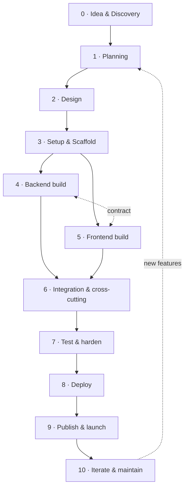

# Project Development Blueprint & Map

A reusable, end-to-end map for building a web app like Beacon — from idea to launch and
beyond. Beacon's stack (React + Vite + Tailwind on the frontend, Firebase as the backend,
Vercel for hosting) is used as the running example, with generic alternatives noted so the
blueprint applies to *similar* projects too.

> **How to use this:** treat each phase as a checklist. Don't do them in a rigid waterfall —
> loop back constantly (the arrow from "Iterate" returns to "Planning"). But **don't skip a
> phase**; skipping Design or Security is what causes rework.

---

## The map (the whole pipeline at a glance)



Backend and frontend are built **in parallel against an agreed contract** (the data model +
security rules). Neither is "first" — you sketch the data shape, then both sides build to it.

### Phase → deliverable → tool (quick reference)

| Phase | You end with | Beacon example / tools |
|---|---|---|
| 0 Discovery | Problem + users + MVP scope | "Curriculum portal for a teacher consortium" |
| 1 Planning | Feature list, data sketch, stack, roadmap | React/Vite/Firebase/Vercel chosen |
| 2 Design | Route map, wireframes, design system, schema, security model | Tailwind tokens; Firestore collections; approval/roles |
| 3 Setup | Running skeleton + repos + tooling | `vite`, Tailwind, ESLint, Firebase project, git |
| 4 Backend | Auth + collections + **rules** + indexes | `firestore.rules`, `firestore.indexes.json` |
| 5 Frontend | Shell + auth UI + feature pages | `App.jsx`, `pages/`, hooks, components |
| 6 Integration | Wired data, PWA, analytics, a11y | offline cache, service worker, `@vercel/analytics` |
| 7 Test/harden | Verified flows, clean lint/build, security pass | drive each flow; `yarn lint && yarn build` |
| 8 Deploy | Live URLs (preview + prod), env set | Vercel + `firebase deploy` |
| 9 Publish | Domain, SEO, PWA install, legal | custom domain, manifest, OG meta |
| 10 Iterate | Monitoring, backlog, docs | code bible, error tracking |

---

## Phase 0 — Idea & Discovery

Decide *what* and *for whom* before *how*.

- **Problem statement:** one sentence — what pain, for whom.
- **Target users & their context:** e.g. Ghanaian teachers, often on mobile, sometimes offline.
  (This one fact drove Beacon's whole PWA/offline direction — user context shapes architecture.)
- **Value proposition & success criteria:** how you'll know it worked.
- **Scope line:** what's in the **MVP** vs "later". Write the "later" list down so you can say no.

**Output:** a one-page brief.

---

## Phase 1 — Planning

- **Requirements as user stories:** "As a member, I can publish a scheme so others can reuse it."
- **Feature list, prioritized:** MVP first; everything else in a backlog with rough phases.
- **Rough data model:** list the *entities* (users, posts, articles, plans…) and how they relate.
  You don't need final fields — just the nouns and their ownership.
- **Tech-stack decision.** Pick by fit, not fashion. The key fork:
  - **SPA + Backend-as-a-Service** (Beacon: React SPA + Firebase) — fastest to ship, no server
    to run, great for auth + realtime + offline. Best when the backend is mostly CRUD + auth.
  - **Full-stack framework** (Next.js/Remix + a database like Postgres via Supabase/Prisma) —
    when you need server rendering, complex server logic, or SQL relations.
- **Architecture decision:** where does logic/security live? (For BaaS, the answer is *security
  rules at the data layer* — see Phase 4.)
- **Roadmap:** phase 1 (MVP), phase 2, phase 3. Keep it short.

**Output:** feature list + data sketch + stack + roadmap.

---

## Phase 2 — Design

Design in three layers before heavy coding.

### 2a. UX / structure
- **User flows** for the core journeys (sign up → get approved → create a scheme → export it).
- **Sitemap / route map:** every page and its URL, split into **public** vs **authenticated**.
  (Beacon: public `/`, `/vacancies`, `/articles`…; protected `/portal/*`.)
- **Wireframes:** low-fidelity layout of each key screen. Paper/Figma is fine.

### 2b. UI / design system
- **Brand:** colours, typography, logo, tone. Pick a small palette (a primary, an accent,
  neutrals) and a type scale.
- **Component vocabulary:** define reusable classes/components up front (page title, card,
  input, button, empty state, skeleton). Beacon codifies these in `index.css`
  (`.page-title`, `.card-title`, …) so every page looks consistent.

### 2c. Data & security design (the contract both sides build to)
- **Schema:** each collection/table — fields, types, ownership (`authorId`), status/visibility.
- **Auth model:** how identity works (email/password, OAuth) and **authorization**: roles
  (`member`/`admin`) and states (`pending` → `approved` → `suspended`).
- **Security matrix:** for each entity, who can read/create/update/delete. This becomes your
  rules in Phase 4. *Design it now* — retrofitting security is painful and dangerous.

**Output:** route map, wireframes, design tokens, schema + security matrix.

---

## Phase 3 — Setup & Scaffolding

Get an empty app running and deployable **before** building features.

- **Repo + version control:** git, a sensible `.gitignore`, branch strategy.
- **Package manager:** pick one and stick to it (Beacon: **yarn** — never mix with npm).
- **Framework init:** `yarn create vite` (React) → runs in the browser.
- **Styling:** install Tailwind (`@tailwindcss/vite`), create the `index.css` design tokens.
- **Quality tooling:** ESLint (+ Prettier/formatting), a `lint` script, editor config.
- **Env handling:** `.env.local` for secrets/config, `import.meta.env.VITE_*`, gitignored.
- **Backend project:** create the Firebase project; enable **Auth** + **Firestore**; grab the
  web config into env vars. (Custom-backend equivalent: provision the DB + API skeleton.)
- **Folder structure:** `pages/ components/ hooks/ lib/ context/` — decide the shape early.
- **Smoke deploy (optional but wise):** push the empty app to Vercel so the pipeline works
  before you have features to lose.

**Output:** a running, deployable skeleton.

---

## Phase 4 — Backend build (the data + rules)

For a BaaS like Firebase, "backend" = data model + auth + **security rules** + indexes
(+ serverless functions when you need real server logic). Build it in this order:

1. **Auth configuration.** Enable providers. On sign-up, create the user's profile document
   (`users/{uid}` with `status: 'pending'`, `role: 'member'`). This profile is your
   authorization source of truth.
2. **Collections & shapes.** Create each collection from the schema. Always stamp
   `authorId` + `createdAt`/`updatedAt` on documents.
3. **Security rules — the real gate.** Write `firestore.rules`: helper functions
   (`isApproved()`, `isAdmin()`, `isOwner()`), then per-collection read/create/update/delete.
   **This is the actual enforcement** — the UI gate is only cosmetics. Pattern: read gated by
   visibility/status/ownership; create requires `authorId == request.auth.uid`; update by
   owner/admin (with a narrow `affectedKeys()` exception for likes); delete by owner/admin.
4. **Indexes.** Add composite indexes in `firestore.indexes.json` for any `where + orderBy`
   query. (Single-field equality needs none — Firestore auto-indexes.)
5. **Serverless / extensions (only if needed).** Cloud Functions or extensions for things the
   client can't/shouldn't do: sending email, scheduled jobs, privileged writes, payments.
6. **Seed / reference data.** Static/read-only data (Beacon's curriculum + quotes JSON) or an
   initial admin user.
7. **Deploy the backend** (separately from the frontend): `firebase deploy --only
   firestore:rules,firestore:indexes[,functions]`. *Committed ≠ deployed.*

> **Custom backend variant (Node/Express/Nest + SQL):** replace steps 2–4 with: define DB
> schema/migrations → build REST/GraphQL endpoints → implement auth middleware + per-route
> authorization → validate inputs. The *principle is identical*: **authorization is enforced
> on the server/data layer, never trusted from the client.**

**Output:** a secured backend the frontend can talk to.

---

## Phase 5 — Frontend build (the UI + data wiring)

Build the shell first, then features as **vertical slices** (one full feature at a time).

1. **App shell.** Router + the provider stack (auth context, toasts) + the base layout
   (nav/sidebar + content outlet). Beacon: `main.jsx` providers, `App.jsx` routes.
2. **Auth UI + the gate.** Login/sign-up pages; a `ProtectedLayout` that redirects
   unauthenticated users and shows "pending/suspended" states. Wire `useAuth()` to the live
   profile doc.
3. **Design system in code.** Implement the tokens/components from Phase 2b (buttons, inputs,
   cards, skeletons, empty states) so features reuse them.
4. **Feature slices — repeat per feature:**
   1. Add the route(s): list, new, view, edit.
   2. Add a **data hook / calls** (read: `getDocs`/`onSnapshot`; write: `addDoc`/`updateDoc`).
   3. Build the **create/edit form** (controlled inputs, validation, submit → write).
   4. Build the **list** and **detail/view** pages.
   5. Handle the **three states everywhere:** loading (skeleton) → empty (empty state) → data.
   6. Wire it to the backend and confirm reads/writes respect the rules.
   7. Add a nav entry.
   8. **Verify by driving the flow** (create → see it in the list → edit → delete).
5. **Integrations** as features need them: rich-text editor, document export (PDF/DOCX/PPTX),
   third-party forms (contact → email), maps, payments.
6. **State & data patterns:** real-time via subscriptions where it helps; client-side derived
   state via render-time computation (not effects); optimistic UI where safe.

**Output:** every MVP feature usable against the real backend.

---

## Phase 6 — Integration & cross-cutting concerns

Things that span the whole app, best added once features exist:

- **Connect + harden data flow:** consistent loading/empty/error handling; graceful
  permission-denied handling.
- **PWA / offline (if relevant):** web manifest + icons (installable), a service worker
  (cache the app shell + static data), and offline data (Beacon uses Firestore's persistent
  cache so writes queue and sync). Add an online/sync indicator.
- **Analytics** (`@vercel/analytics` or similar), **SEO/meta** (titles, description, Open
  Graph), **accessibility** (labels, focus, contrast, keyboard), **responsive** passes.

**Output:** a cohesive, installable, measurable app.

---

## Phase 7 — Testing & hardening

- **Manual verification loop:** run the app and *drive each real flow* — don't assume a build
  that compiles works. (This is the single highest-value habit.)
- **Automated checks:** `yarn lint && yarn build` must be clean. Add unit/integration/e2e
  tests where logic is risky (rules unit tests, exporters, pure helpers).
- **Security review:** re-read the rules against the security matrix; confirm no collection is
  unguarded (a real Beacon bug: an `articles` collection shipped with no rule → denied in
  prod). Confirm no true secrets are exposed client-side (public keys like Firebase/Web3Forms
  config are fine; server secrets are not).
- **Edge cases:** empty data, huge data, slow/offline network, unauthorized users, invalid input.
- **Cross-device / browser / dark mode / responsive.**

**Output:** a build you trust.

---

## Phase 8 — Deployment

Two independent pipelines — don't conflate them:

- **Frontend → host (Vercel):** connect the repo; set the build command + output; add the
  `VITE_*` env vars (Production + Preview); configure SPA rewrites so client routes work
  (`/(.*) → /index.html`). Every push gets a **preview deploy**; the main branch is production.
- **Backend → Firebase CLI:** `firebase deploy --only firestore:rules,firestore:indexes,
  functions`. This is **not** done by the host — a common trap ("works locally, 403s in prod"
  because rules weren't deployed).
- **Environments:** keep dev / preview / prod separate; never hardcode prod secrets.
- **CI/CD (optional):** automate lint/build/test on PRs; auto-deploy on merge.

**Output:** a live, reproducible deployment.

---

## Phase 9 — Publishing & launch

- **Custom domain + HTTPS:** point DNS at the host; enable the auto TLS cert.
- **Discoverability:** favicons, PWA install metadata, `robots.txt`/sitemap, Open Graph/Twitter
  cards for nice link previews.
- **Legal/trust:** privacy policy + terms if you collect data; cookie/consent if needed.
- **Seed real content & first users:** an admin account, starter data, and an onboarding path.
- **Announce:** share the link; onboard the first cohort; watch for issues.

**Output:** a publicly usable product.

---

## Phase 10 — Iterate & maintain

- **Monitor:** error tracking (Sentry), analytics, uptime; watch the first real users closely.
- **Feedback → backlog → slices:** ship improvements the same vertical-slice way.
- **Keep docs current:** a "code bible" (see the rest of this `docs/` folder) so you — or the
  next dev, or an AI agent — stay oriented. Update it when behavior changes.
- **Housekeeping:** dependency updates, security patches, index/rule tidy-ups, dead-code removal.

**Output:** a living product that keeps improving.

---

## The two build loops, side by side

Because the coding phase runs frontend and backend together, here they are as explicit,
repeatable checklists.

### Backend build loop (per entity)
```
1. Define the document/table shape (fields, ownership, status/visibility)
2. Decide who can read / create / update / delete  ← the security matrix
3. Write the security rule (or API route + authz middleware)
4. Add indexes for any where+orderBy query
5. (If needed) a serverless function for privileged/async work
6. Deploy rules/indexes/functions
7. Verify: try allowed AND forbidden operations
```

### Frontend build loop (per feature)
```
1. Add routes: list · new · view · edit
2. Add data access (read: subscribe/fetch; write: create/update/delete)
3. Build the form (controlled inputs + validation + submit)
4. Build list + detail views
5. Handle loading → empty → error → data everywhere
6. Add nav entry + links between screens
7. Verify by driving the full flow in the browser
8. Polish: responsive, a11y, copy
```

---

## Cross-cutting principles (true in every phase)

1. **Build in vertical slices, keep it always-runnable.** A working thin end-to-end feature
   beats half of everything.
2. **Verify by driving the real flow**, not just by building. Observe behavior.
3. **Security lives at the data/server layer**, never in the UI alone. Design it in Phase 2,
   enforce it in Phase 4, re-check it in Phase 7.
4. **Commit small, one concern at a time**, with clear messages.
5. **Document as you go** — the blueprint (this) and the code bible (the rest of `docs/`).
6. **Tooling discipline:** one package manager, clean lint/build as a gate.
7. **User context drives architecture** (offline-first, mobile-first, low-bandwidth…). Decide
   it in Phase 0–1, not after.
8. **Deploy early, deploy often**; keep frontend and backend deploys distinct and repeatable.
